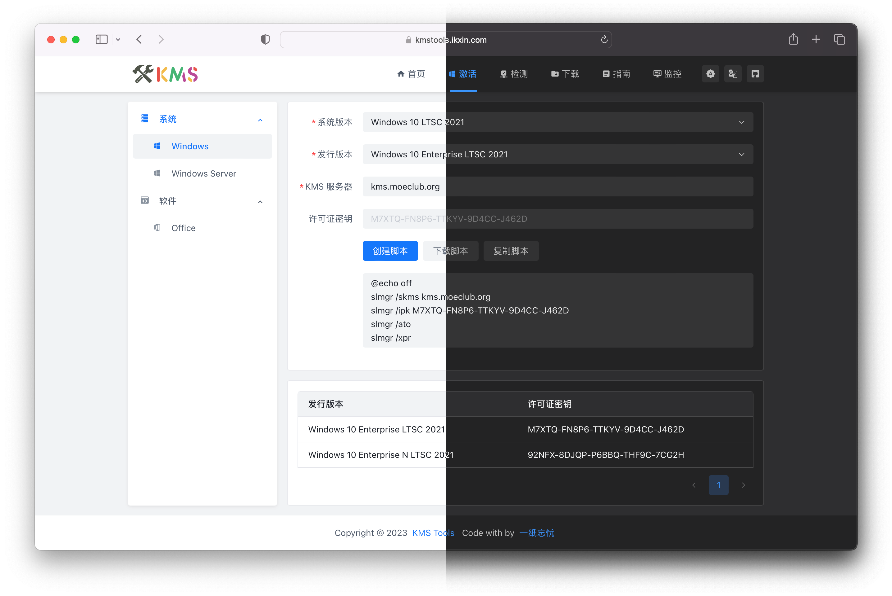

<p align="center"></p>

<p align="center">
<a href="https://github.com/ikxin/kms-tools/releases"></a>
<a href="https://github.com/ikxin/kms-tools/stargazers"></a>
<a href="https://github.com/ikxin/kms-tools/network/members"></a>
<a href="https://github.com/ikxin/kms-tools/commits"></a>
<a href="https://github.com/ikxin/kms-tools/issues"></a>
<a href="https://github.com/ikxin/kms-tools/watchers"></a>
<a href="https://github.com/ikxin/kms-tools/blob/master/LICENSE"></a>
</p>

## 📦 使用

- Server: [https://kmstools.ikxin.com](https://kmstools.ikxin.com)
- Cloudflare: [https://kmstools.pages.dev](https://kmstools.pages.dev)
- Vercel: [https://kmstools.vercel.app](https://kmstools.vercel.app)



## ✨ 技术栈

-  [Vue.js](https://github.com/vuejs/core) - 构建用户界面的 JavaScript 框架
-  [Bun](https://github.com/oven-sh/bun) - 用于 JavaScript 和 TypeScript 应用程序的一体化工具包
-  [Vite](https://github.com/vitejs/vite) - 下一代的前端工程构建工具
-  [Arco Design Vue](https://github.com/arco-design/arco-design-vue) - ByteDance 开发的企业级产品设计系统
-  [Vue Router](https://github.com/vuejs/vue-router) - Vue.js 核心团队开发的路由组件
-  [Pinia](https://github.com/unocss/unocss) - 类型安全、可扩展性以及模块化设计的状态管理库
-  [VueUse](https://github.com/vueuse/vueuse) - 基于 Composition API 的实用函数集合
-  [UnoCSS](https://github.com/unocss/unocss) - 即时的按需加载原子 CSS 引擎
-  [Vue I18n](https://github.com/intlify/vue-i18n-next) - I18n 国际化支持
-  [unplugin-auto-import](https://github.com/antfu/unplugin-auto-import) - 自动按需导入 Composition API 的插件
-  [unplugin-vue-components](https://github.com/antfu/unplugin-vue-components) - 自动按需导入 Vue 组件的插件
-  [unplugin-vue-router](https://github.com/posva/unplugin-vue-router) - Vue Router 自动加载基于文件的路由系统
-  [unplugin-vue-markdown](https://github.com/unplugin/unplugin-vue-markdown) - Markdown 文档支持

## ⚙️ 构建

```
自行构建前需要拥有 node.js, pnpm 等必要依赖
```

### 克隆代码

```bash
git clone https://github.com/ikxin/kms-tools.git
```

### 构建打包

```bash
# 进入项目
cd kms-tools
# 安装依赖
pnpm install
# 开发环境
pnpm run dev
# 开始构建
pnpm run build
# 预览构建
pnpm run preview
```

## ⭐ 星星


## 🧑‍💻 作者

Code with ❤️ by [一纸忘忧](https://www.ikxin.com '一纸忘忧')

## 📜 开源协议

[MIT License](./LICENSE 'MIT License')

Copyright (c) 2022~Present
