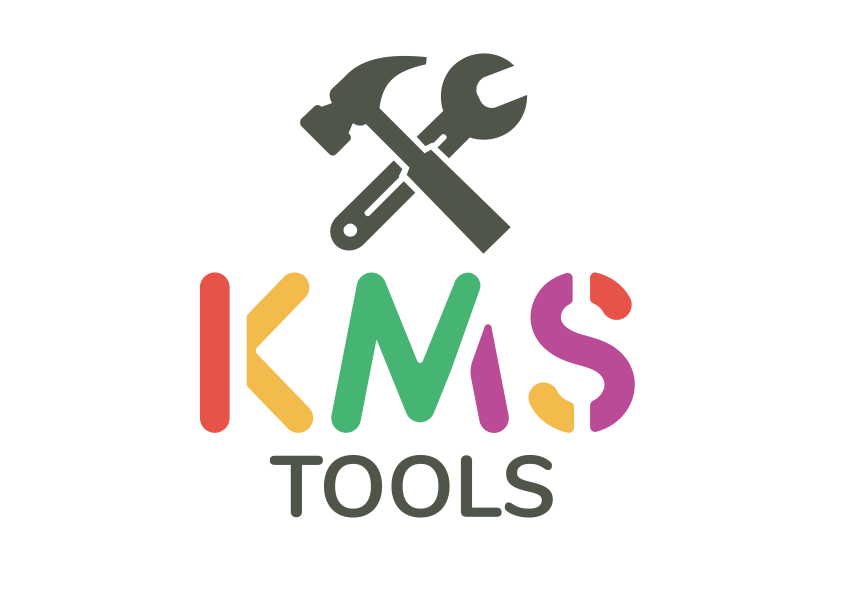

<p align="center">
    
</p>

<div align="center">

[](https://github.com/ikxin/kms-tools/issues)
[](https://github.com/ikxin/kms-tools/network)
[](https://github.com/ikxin/kms-tools/stargazers)
[](https://github.com/ikxin/kms-tools/blob/master/LICENSE)

</div>

## 📸 预览


## ✨ 技术栈

- Vue3
- Vite
- Ant Design Vue

## 🚀 使用

1. 在桌面右键选择此电脑点击属性，查看当前电脑的系统版本
2. 在下方表单中选择对应的系统版本，复制或下载激活脚本，使用管理员权限运行该脚本。
3. 使用KMS服务器激活系统后，有效期为180天。
4. 系统每7天会连接一次KMS服务器，获取最新的授权，然后激活有效期会重置为180天。
5. 如果激活失败可先尝试清除后激活，查看下方清除脚本。

<details>
<summary>查看代码</summary>
<pre>
@echo off
slmgr /upk
slmgr /ckms
slmgr /rearm
</pre>
</details>

## 📦 安装

1. 从 Releases 下载打包好的程序
2. 上传到自有服务器或 Github Pages、Cloudflare Pages、Vercel 等平台

## ⚙️ 构建

```
自行构建前需要拥有 node.js、npm、vite、less-loader 等必要依赖
```

### 克隆代码

```bash
git clone https://github.com/ikxin/kms-tools.git
```

### 构建打包

```bash
# 进入项目
cd kms-tools
# 安装依赖
npm install
# 开发环境
npm run dev
# 开始构建
npm run build
# 预览构建
npm run preview
```

## ⭐ 星星

[](https://starchart.cc/ikxin/kms-tools)

## 🧑‍💻 作者

Code with ❤️ by [一纸忘忧](https://www.ikxin.com "一纸忘忧")

## 📜 开源协议

[MIT License](./LICENSE "MIT License")

Copyright (c) 2022~Present
