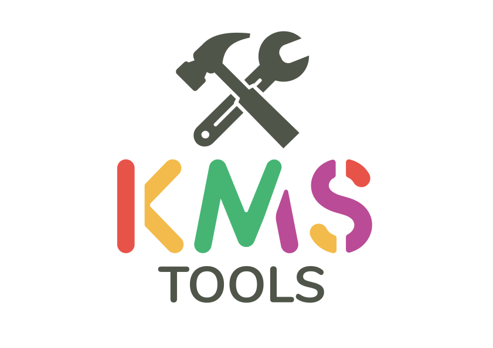
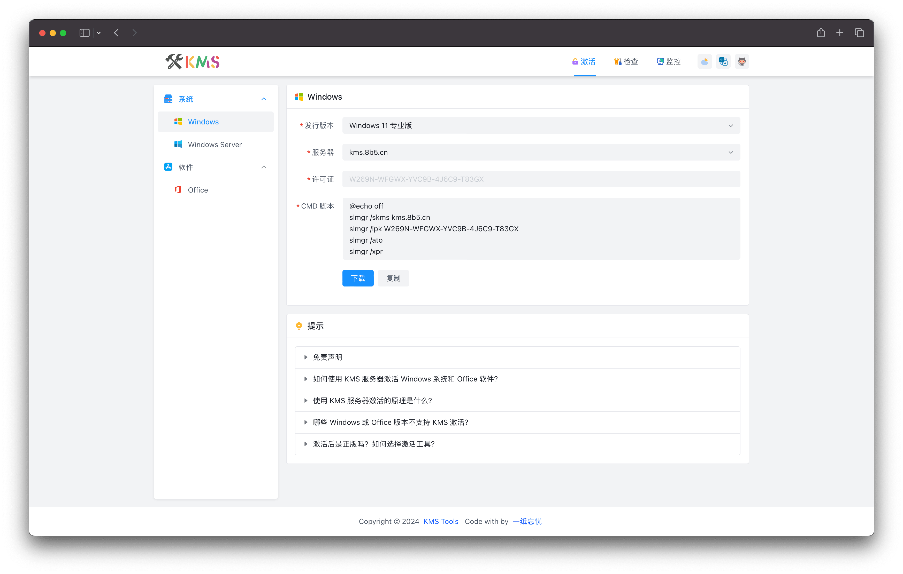
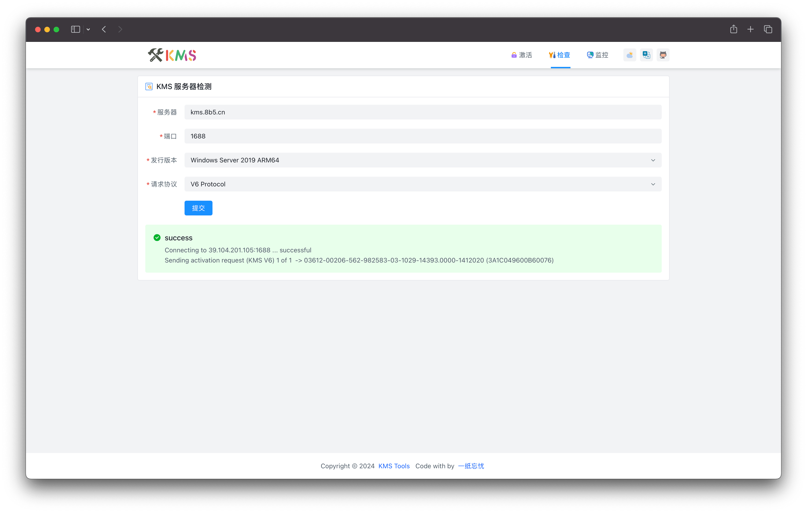
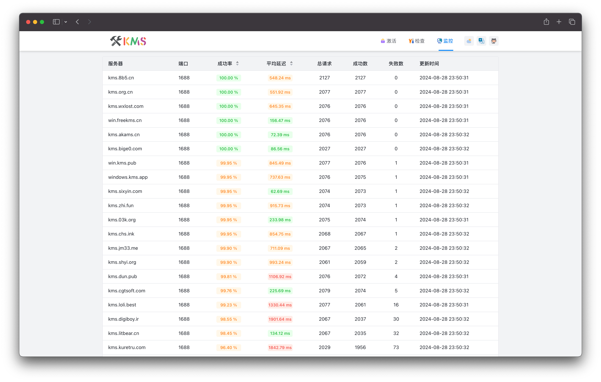

<p align="center">
  
</p>

<p align="center">
  <a href="https://github.com/ikxin/kms-tools/releases"></a>
  <a href="https://github.com/ikxin/kms-tools/actions/workflows/ci.yml"></a>
  <a href="https://hub.docker.com/r/ikxin/kms-tools"></a>
  <a href="https://github.com/ikxin/kms-tools/stargazers"></a>
  <a href="https://github.com/ikxin/kms-tools/network/members"></a>
  <a href="https://github.com/ikxin/kms-tools/blob/main/LICENSE"></a>
</p>

<p align="center">
  <a href="./README.md">简体中文</a> | <a href="./README.en.md">English</a>
</p>

## 📖 介绍

KMS Tools 是一个一站式 KMS 工具箱，基于 Nuxt 4 全栈框架构建，集成了 KMS 激活脚本生成、KMS 服务器检测、KMS 服务器状态监控等功能。

> [!NOTE]
> 项目依赖于 Node.js 的 `child_process` 模块来调用 `vlmcs` 二进制文件执行 KMS 检测服务，无法在 GitHub Pages 等纯静态网站托管平台上运行，因此区分了全栈版本和静态版本两种部署方式。

## ✨ 功能特性

- 🔑 **KMS 激活脚本生成** - 一键生成 Windows / Windows Server / Office 的 KMS 激活脚本
- 🔍 **KMS 服务器检测** - 实时检测 KMS 服务器的可用性和响应时间
- 📊 **KMS 服务器监控** - 持续监控多个 KMS 服务器的运行状态，提供可视化图表
- 🌍 **国际化支持** - 支持简体中文和英文界面切换
- 🌗 **暗色模式** - 支持亮色 / 暗色 / 跟随系统三种主题模式
- 🐳 **Docker 部署** - 提供开箱即用的 Docker 镜像，支持 AMD64 和 ARM64 架构

## 🌈 界面预览

| KMS 激活脚本生成                      | KMS 服务器检测                     | KMS 服务器状态监控                   |
| ------------------------------------- | ---------------------------------- | ------------------------------------ |
|  |  |  |

## 📦 演示

### 全栈版本

https://kms.ikxin.com

### 静态版本

静态版本默认调用 https://kms.ikxin.com 的 API 接口，也可以自行部署全栈版本，然后通过环境变量 `NUXT_PUBLIC_API_URL` 设置。

| 平台       | 演示链接                      |
| ---------- | ----------------------------- |
| Vercel     | https://kms-tools.vercel.app  |
| Cloudflare | https://kmstools.pages.dev    |
| Netlify    | https://kms-tools.netlify.app |

## 🛠️ 技术栈

| 技术                                                              | 说明                                 |
| ----------------------------------------------------------------- | ------------------------------------ |
| [Nuxt](https://github.com/nuxt/nuxt)                              | 基于 Vue.js 的全栈 Web 应用框架      |
| [Vue.js](https://github.com/vuejs/core)                           | 渐进式 JavaScript 框架               |
| [Nitro](https://github.com/nitrojs/nitro)                         | 基于 unjs/h3 的高性能 Web 服务端框架 |
| [Vite](https://github.com/vitejs/vite)                            | 极速开发服务器和现代构建工具         |
| [TypeScript](https://github.com/microsoft/TypeScript)             | 带类型系统的 JavaScript 超集         |
| [Tailwind CSS](https://github.com/tailwindlabs/tailwindcss)       | 实用性优先的 CSS 框架                |
| [Arco Design Vue](https://github.com/arco-design/arco-design-vue) | 字节跳动开发的企业级产品设计系统     |
| [ECharts](https://github.com/apache/echarts)                      | 功能丰富的交互式图表库               |
| [VueUse](https://github.com/vueuse/vueuse)                        | 基于 Composition API 的实用函数集合  |
| [Nuxt I18n](https://github.com/nuxt-modules/i18n)                 | 适用于 Nuxt 的国际化支持插件         |

## 📦 部署

### 环境变量

| 名称                       | 示例值                      | 描述                                                              |
| -------------------------- | --------------------------- | ----------------------------------------------------------------- |
| `NUXT_PUBLIC_API_URL`      | `https://kms.ikxin.com`     | 静态版本 API 接口地址                                             |
| `NUXT_MONITOR_LIST`        | `kms.org.cn,win.freekms.cn` | 自定义监控 KMS 服务器列表，使用 `,` 分隔                          |
| `NUXT_ENABLE_VLMCSD`       | `false`                     | 是否启用内置 VLMCSD 服务                                          |
| `PORT`                     | `3000`                      | 服务监听端口（也可使用 `NITRO_PORT`）                             |

> [!NOTE]
> 生产环境（`node .output/server/index.mjs`）不会自动读取 `.env` 文件，环境变量需要在运行前通过系统环境或部署平台进行配置。`.env` 文件仅在开发和构建阶段有效。

### 全栈版本

#### Docker（推荐）

使用 Docker Compose：

```yaml
services:
  kms-tools:
    image: ikxin/kms-tools:latest
    container_name: kms-tools
    ports:
      - 3000:3000
      - 1688:1688
    volumes:
      - kms-data:/app/.data
    environment:
      - NUXT_MONITOR_LIST=kms.org.cn,win.freekms.cn
    restart: unless-stopped

volumes:
  kms-data:
```

或者使用 Docker CLI：

```bash
docker run -d \
  --name kms-tools \
  -p 3000:3000 \
  -p 1688:1688 \
  -v kms-data:/app/.data \
  ikxin/kms-tools:latest
```

镜像也可以从 GitHub Container Registry 拉取：

```bash
docker pull ghcr.io/ikxin/kms-tools:latest
```

#### Zeabur

[](https://zeabur.com/templates/TXR0D9)

#### 手动部署

1. 克隆项目仓库到本地，安装依赖

```bash
git clone https://github.com/ikxin/kms-tools.git
cd kms-tools && pnpm install
```

2. 构建项目

```bash
pnpm run build
```

3. 启动服务，项目默认监听 `3000` 端口，可通过 `PORT` 环境变量修改

```bash
node .output/server/index.mjs
```

如需自定义端口和监控列表，可在启动时设置环境变量：

```bash
PORT=3512 NUXT_MONITOR_LIST=kms.example.com node .output/server/index.mjs
```

### 静态版本

几乎所有 SaaS 平台都支持静态网站托管服务，以下是通用的部署方式：

> [!WARNING]
> 注意：如果你使用的是 Cloudflare Pages，部署时需要将 `NODE_VERSION` 设置为 `22`，否则构建时会出现报错。

1. Fork 本项目仓库到自己的 GitHub 账户
2. 在 SaaS 平台创建项目，选择刚才 Fork 的仓库
3. 设置项目的构建命令为 `pnpm run generate`
4. 设置环境变量 `NUXT_PUBLIC_API_URL=https://kms.ikxin.com`
5. 点击部署项目即可

> [!NOTE]
> 如果在其他 SaaS 平台部署时遇到问题，欢迎提交 [Issue](https://github.com/ikxin/kms-tools/issues) 来获得支持。

## 🔧 本地开发

```bash
# 克隆项目
git clone https://github.com/ikxin/kms-tools.git
cd kms-tools

# 安装依赖
pnpm install

# 启动开发服务器
pnpm run dev

# 构建生产版本
pnpm run build

# 生成静态版本
pnpm run generate
```

## 🤝 参与贡献

欢迎各种形式的贡献！请先阅读 [贡献指南](./CONTRIBUTING.md)。

1. Fork 本仓库
2. 创建你的功能分支 (`git checkout -b feature/amazing-feature`)
3. 提交你的更改 (`git commit -m 'feat: add amazing feature'`)
4. 推送到分支 (`git push origin feature/amazing-feature`)
5. 提交 Pull Request

## ⭐ Star 历史


## 💖 赞助商

本项目 CDN 加速及安全防护由 Tencent EdgeOne 赞助。

[](https://edgeone.ai/zh?from=github)

## 📄 开源协议

本项目基于 [MIT License](./LICENSE) 开源。

## 🧑‍💻 作者

Code with ❤️ by [一纸忘忧](https://blog.ikxin.com '一纸忘忧')

## 📜 开源协议

[MIT License](./LICENSE 'MIT License') Copyright (c) 2022 ~ Present
