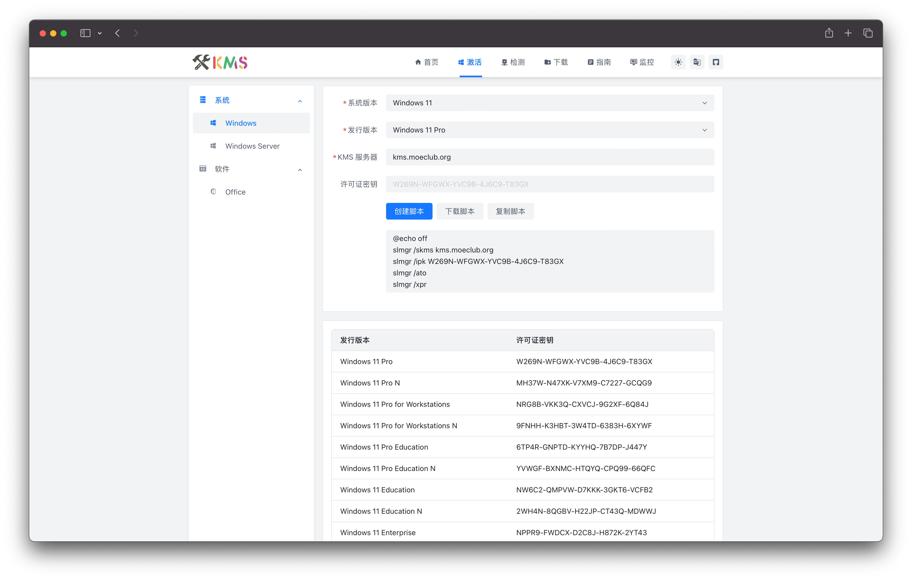
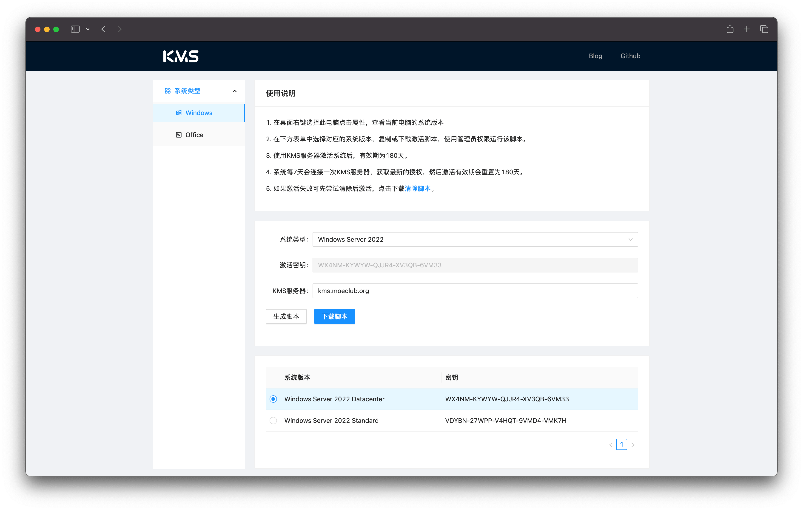
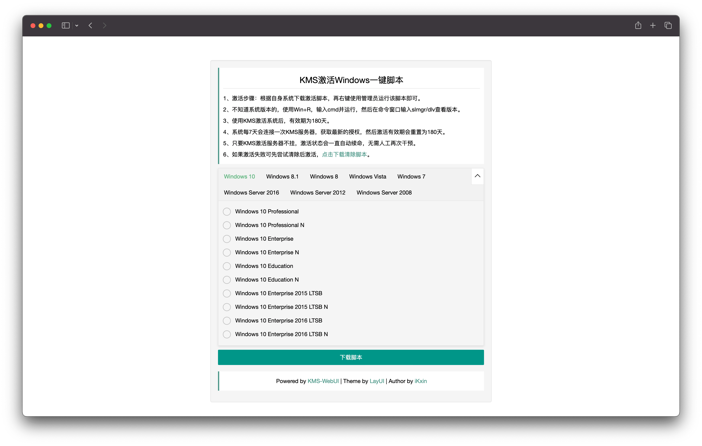

<a href="./README.md">简体中文</a>

## 📖 Introduction

A one-stop KMS toolbox, integrating features such as KMS activation script generation, KMS server detection, and KMS server status monitoring.

This project was first created in April 2020 and initially released on the [Hostloc Forum](https://hostloc.com/thread-669158-1-1.html). At that time, it was just a small tool used for generating KMS activation scripts. While in college, I was responsible for maintaining the computer equipment in classrooms and labs. I often had to reinstall various versions of operating systems, and this small tool improved the efficiency of activating those operating systems. In June 2022, I revisited this tool, restructured it using many new technologies, and once again released it on the [Hostloc Forum](https://hostloc.com/thread-1026408-1-1.html), gaining attention and support from many experts.

I continued to occasionally update the tool with new features, but it was never quite perfect until I received two special issues, "[#25](https://github.com/ikxin/kms-tools/issues/25)" and "[#26](https://github.com/ikxin/kms-tools/issues/26)". One of them was even initiated in a non-Chinese language, which I did not expect for such a small project to attract the attention of international friends. As my first open-source "debut," I decided to continue developing and maintaining it.

The original version was a pure front-end tool. To implement KMS detection and KMS monitoring features, I developed a backend service using Bun + Elysia, splitting the project into a pure front-end version and a full-stack version. The front-end version can call the API interface from [kms.ikxin.com](https://kms.ikxin.com), while the full-stack version allows you to independently deploy all features, including Vlmcsd as a KMS activation server.

## 📦 Online Usage

### Full-stack Version

- Official website: [kms.ikxin.com](https://kms.ikxin.com)

### Pure Front-end Version

- Cloudflare: [kmstools.pages.dev](https://kmstools.pages.dev)
- Vercel: [kmstools.vercel.app](https://kmstools.vercel.app)

## 👀 Previous Versions

|  |  |
| ----------------------------------- | ----------------------------------- |
|  |  |

## ✨ Tech Stack

### Backend

-  [Bun](https://github.com/oven-sh/bun) - An all-in-one toolkit for JavaScript and TypeScript applications
-  [Drizzle ORM](https://github.com/drizzle-team/drizzle-orm) - Next-generation headless TypeScript ORM framework
-  [Elysia](https://github.com/elysiajs/elysia) - An ergonomic web framework for building backend servers using Bun

### Frontend

-  [Vue.js](https://github.com/vuejs/core) - A JavaScript framework for building user interfaces
-  [Vite](https://github.com/vitejs/vite) - A next-generation front-end build tool
-  [Arco Design Vue](https://github.com/arco-design/arco-design-vue) - An enterprise-level product design system developed by ByteDance
-  [Vue Router](https://github.com/vuejs/vue-router) - The official routing library for Vue.js, developed by the core Vue.js team
-  [Pinia](https://github.com/vuejs/pinia) - A type-safe, extensible, and modular state management library
-  [VueUse](https://github.com/vueuse/vueuse) - A collection of useful utilities based on the Composition API
-  [UnoCSS](https://github.com/unocss/unocss) - An on-demand atomic CSS engine
-  [Vue I18n](https://github.com/intlify/vue-i18n-next) - Internationalization (I18n) support for Vue.js
-  [unplugin-auto-import](https://github.com/antfu/unplugin-auto-import) - A plugin for automatically importing the Composition API on demand
-  [unplugin-vue-components](https://github.com/antfu/unplugin-vue-components) - A plugin for automatically importing Vue components on demand
-  [unplugin-vue-router](https://github.com/posva/unplugin-vue-router) - A file-based routing system for Vue Router with automatic loading
-  [unplugin-vue-markdown](https://github.com/unplugin/unplugin-vue-markdown) - Markdown documentation support

## ⭐ Stars

## 🧑‍💻 Author

Code with ❤️ by [ikxin](https://www.ikxin.com 'ikxin')

## 📜 License

[MIT License](./LICENSE 'MIT License')

Copyright (c) 2022~Present
