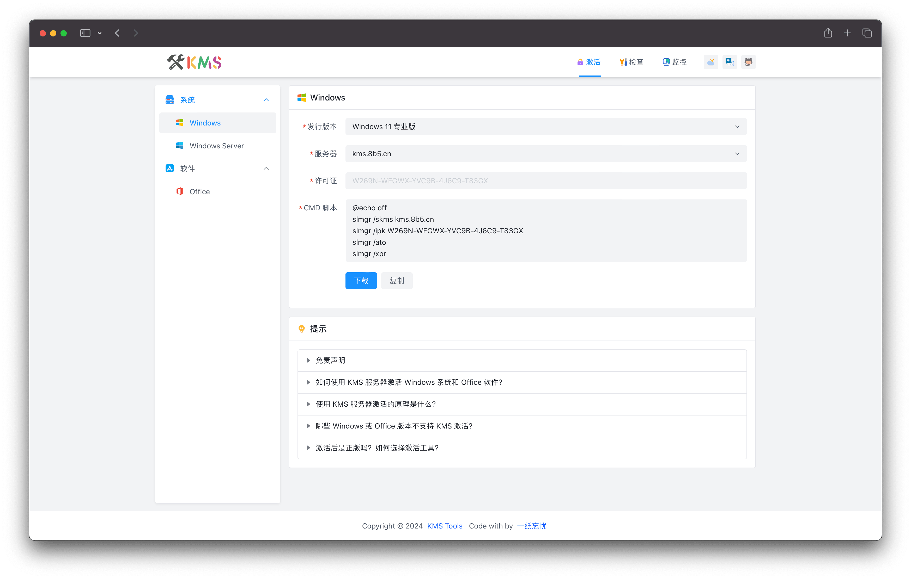
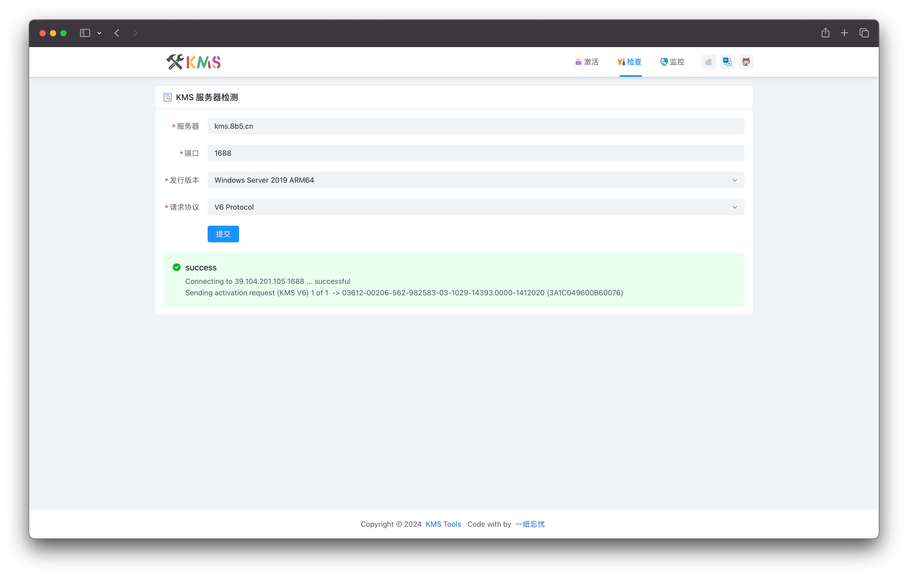
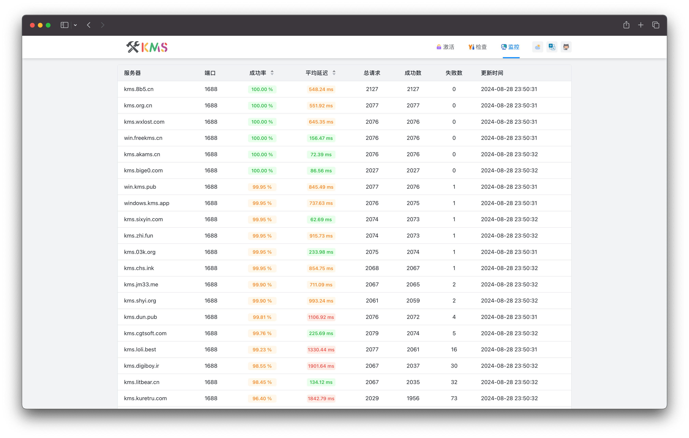

<p align="center">
  
</p>

<p align="center">
  <a href="https://github.com/ikxin/kms-tools/releases"></a>
  <a href="https://github.com/ikxin/kms-tools/stargazers"></a>
  <a href="https://github.com/ikxin/kms-tools/network/members"></a>
  <a href="https://github.com/ikxin/kms-tools/commits"></a>
  <a href="https://github.com/ikxin/kms-tools/issues"></a>
  <a href="https://github.com/ikxin/kms-tools/watchers"></a>
  <a href="https://github.com/ikxin/kms-tools/blob/master/LICENSE"></a>
</p>

<p align="center" class="hidden">
  <a href="./README.md">English</a>
</p>

## 📖 介绍

一站式 KMS 工具箱，集成了 KMS 激活脚本生成、KMS 服务器检测、KMS 服务器状态监控等功能。

## 📦 项目演示

### 全栈版本

感谢 [Zebaur](https://zeabur.com/referral?referralCode=ikxin&utm_source=ikxin&utm_campaign=oss) 提供服务进行项目部署。

- [kms.ikxin.com](https://kms.ikxin.com)

### 前端版本

默认调用 [kms.ikxin.com](https://kms.ikxin.com) 的 API 接口，也可以自行部署后端服务。

- Cloudflare: [kmstools.pages.dev](https://kmstools.pages.dev)
- Vercel: [kmstools.vercel.app](https://kmstools.vercel.app)
- Netlify: [kms-tools.netlify.app](https://kms-tools.netlify.app)

## 🌈 功能预览

| KMS 激活脚本生成                      | KMS 服务器检测                     | KMS 服务器状态监控                   |
| ------------------------------------- | ---------------------------------- | ------------------------------------ |
|  |  |  |

## ✨ 技术栈

- [Nuxt](https://github.com/nuxt/nuxt) - 基于 Vue.js 的全栈 Web 应用框架
- [Vue.js](https://github.com/vuejs/core) - 渐进式 JavaScript 框架
- [Nitro](https://github.com/nitrojs/nitro) - 基于 unjs/h3 的高性能 Web 服务端框架
- [Vite](https://github.com/vitejs/vite) - 极速开发服务器和现代构建工具
- [VueUse](https://github.com/vueuse/vueuse) - 基于 Composition API 的实用函数集合
- [Tailwind CSS](https://github.com/tailwindlabs/tailwindcss) - 实用性优先的 CSS 框架
- [Arco Design Vue](https://github.com/arco-design/arco-design-vue) - 字节跳动开发的企业级产品设计系统
- [Nuxt I18n](https://github.com/nuxt-modules/i18n) - 适用于 Nuxt 的国际化支持插件

## 📦 部署

### 全栈版本

#### Zeabur 部署

[](https://zeabur.com/templates/TXR0D9)

#### Docker 部署

```bash
docker run -d --name kms-tools -p 3000:3000 ikxin/kms-tools
```

#### 手动部署

1. 克隆项目仓库到本地，执行命令安装依赖

```bash
git clone https://github.com/ikxin/kms-tools.git
cd kms-tools && pnpm install
```

2. 执行命令构建项目

```bash
pnpm run build
```

3. 执行命令启动服务，项目默认监听 `3000` 端口

```bash
node .output/server/index.mjs
```

### 前端版本

#### Cloudflare 部署

1. Fork 本项目到自己的仓库

2. 在 Cloudflare Pages 创建项目，选择 Fork 的仓库

3. 配置构建命令

```bash
pnpm run generate
```

4. 配置环境变量

| 名称                  | 值                      |
| --------------------- | ----------------------- |
| `NODE_VERSION`        | `22`                    |
| `NUXT_PUBLIC_API_URL` | `https://kms.ikxin.com` |

5. 点击部署项目

#### Vercel 部署

1. Fork 本项目到自己的仓库

2. 在 Vercel 创建项目，选择 Fork 的仓库

3. 配置构建命令

```bash
pnpm run generate
```

4. 配置环境变量

| 名称                  | 值                      |
| --------------------- | ----------------------- |
| `NUXT_PUBLIC_API_URL` | `https://kms.ikxin.com` |

5. 点击部署项目

#### Netlify 部署

1. Fork 本项目到自己的仓库

2. 在 Netlify 创建项目，选择 Fork 的仓库

3. 配置构建命令

```bash
pnpm run generate
```

4. 配置环境变量

| 名称                  | 值                      |
| --------------------- | ----------------------- |
| `NUXT_PUBLIC_API_URL` | `https://kms.ikxin.com` |

5. 点击部署项目

#### 手动部署

1. 克隆项目仓库到本地，执行命令安装依赖

```bash
git clone https://github.com/ikxin/kms-tools.git
cd kms-tools && pnpm install
```

2. 执行命令构建项目

```bash
pnpm run generate
```

3. 项目构建完成后，将 `.output/public` 目录下的文件上传到服务器

## ⭐ 星星


## 🧑‍💻 作者

Code with ❤️ by [一纸忘忧](https://blog.ikxin.com '一纸忘忧')

## 📜 开源协议

[MIT License](./LICENSE 'MIT License') Copyright (c) 2022 ~ Present
