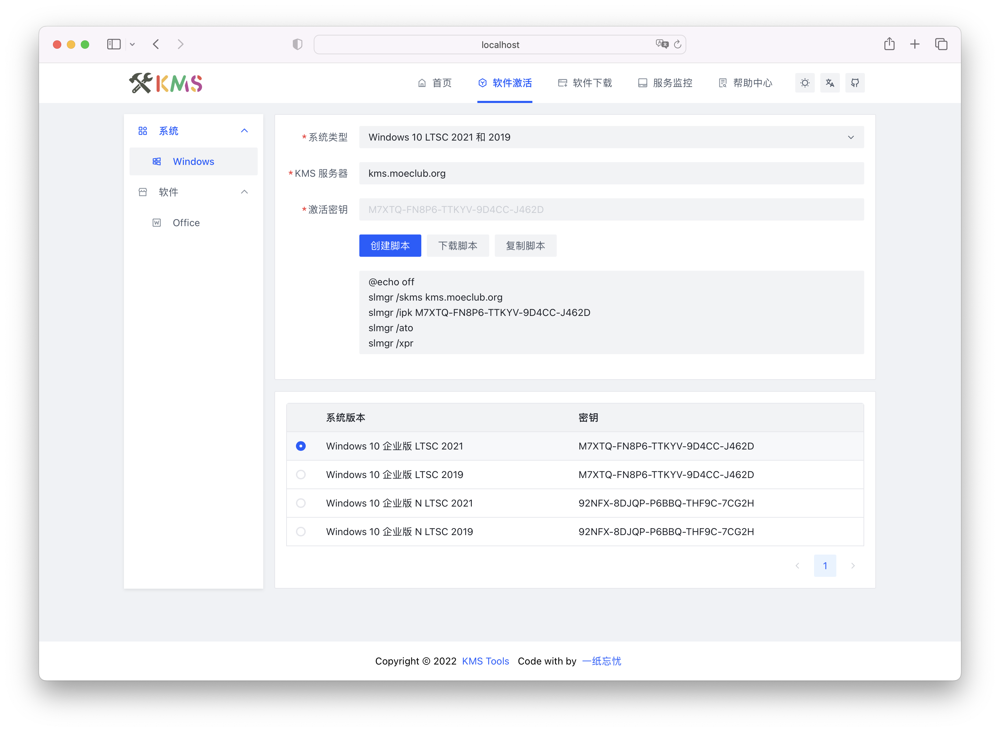

<p align="center">
    
</p>

<div align="center">

[](https://github.com/ikxin/kms-tools/releases)
[](https://github.com/ikxin/kms-tools/stargazers)
[](https://github.com/ikxin/kms-tools/network/members)
[](https://github.com/ikxin/kms-tools/commits)
[](https://github.com/ikxin/kms-tools/issues)
[](https://github.com/ikxin/kms-tools/watchers)
[](https://github.com/ikxin/kms-tools/blob/master/LICENSE)

</div>

## 📸 预览

- Server：[https://studio.ikxin.com/kms-tools](https://studio.ikxin.com/kms-tools)
- Vercel：[https://kmstools.vercel.app](https://kmstools.vercel.app)
- Cloudflare Pages：[https://kmstools.pages.dev](https://kmstools.pages.dev)



## ✨ 技术栈

- 🌈 [Vue3](https://github.com/vuejs/core)
- 📦 [Vue Router](https://github.com/vuejs/vue-router)
- 🚀 [Vite](https://github.com/vitejs/vite)
- 🎨 [Ant Design Vue](https://github.com/vueComponent/ant-design-vue)
- ⚙️ [pnpm](https://github.com/pnpm/pnpm)

## 📦 部署

视频教程：[哔哩哔哩](https://www.bilibili.com/video/BV1SF411K7bq) |
[YouTube](https://youtu.be/-Qu5A5Y5New) |
[知乎](https://www.zhihu.com/zvideo/1533447796237168640) |
[西瓜视频](https://www.ixigua.com/7122706847584223751)

- 从 [Releases](https://github.com/ikxin/kms-tools/releases) 下载打包好的程序
- 上传到自有服务器或 Github Pages、Cloudflare Pages、Vercel 等平台

## ⚙️ 构建

```
自行构建前需要拥有 node.js, pnpm 等必要依赖
```

### 克隆代码

```bash
git clone https://github.com/ikxin/kms-tools.git
```

### 构建打包

```bash
# 进入项目
cd kms-tools
# 安装依赖
pnpm install
# 开发环境
pnpm run dev
# 开始构建
pnpm run build
# 预览构建
pnpm run preview
```

## ⭐ 星星


## 🧑‍💻 作者

Code with ❤️ by [一纸忘忧](https://www.ikxin.com '一纸忘忧')

## 📜 开源协议

[MIT License](./LICENSE 'MIT License')

Copyright (c) 2022~Present
